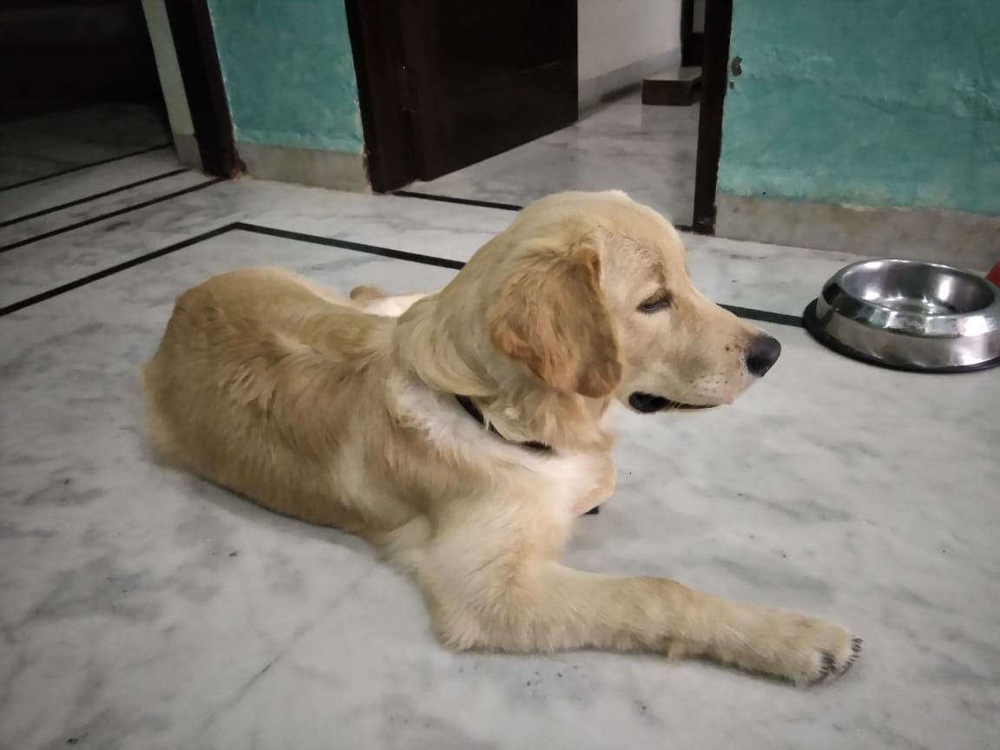

Kuldeep Singh
Roll Number -16235
Department - PHY(BSMS 2016 Batch)

**HOW TO RUN**
NST_image.ipynb is a standalone file. Open and click run all.

**Required Packages**
- PIL
- Pytorch
- matplotlib

**Data**
Images folder have all the style, content, and stylized images.
There naming is done as -- first 3 chars of style image name + first 3 chars of content image name + num_steps.jpg

**Example**
|Art|Original|Combined|
|---|--------|--------|
|||.jpg)|